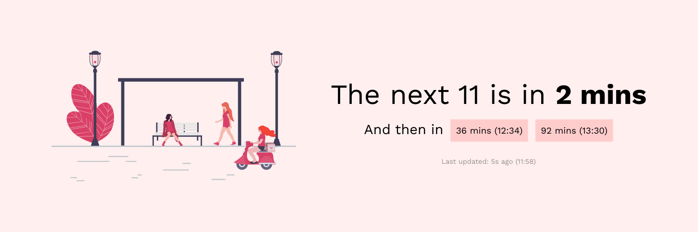
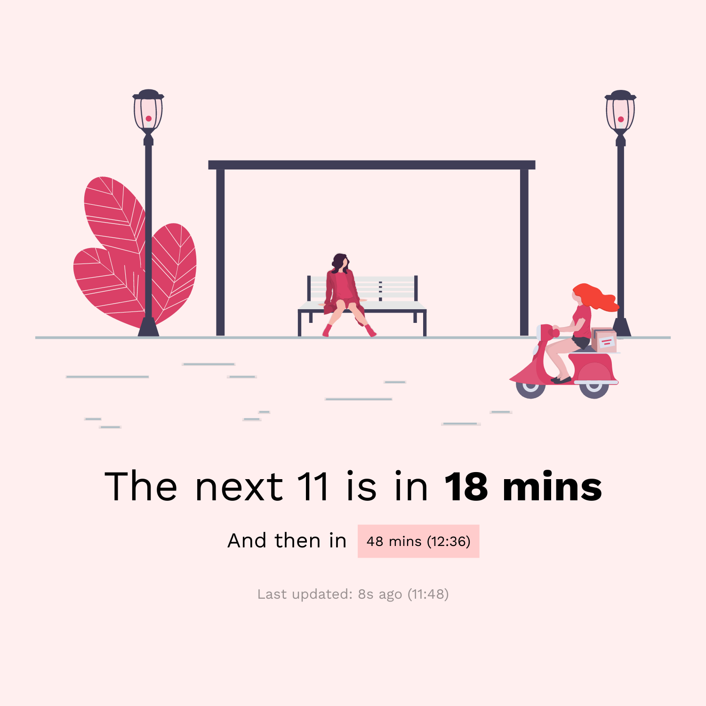
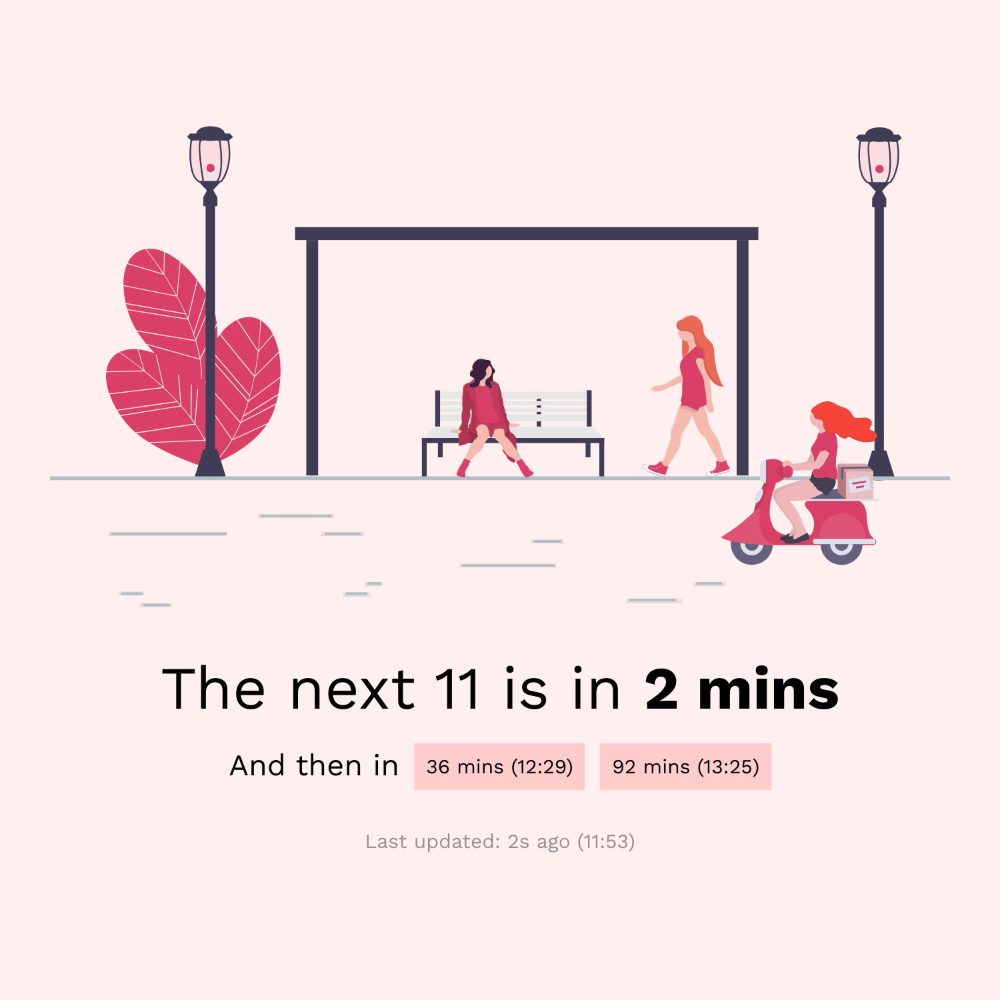
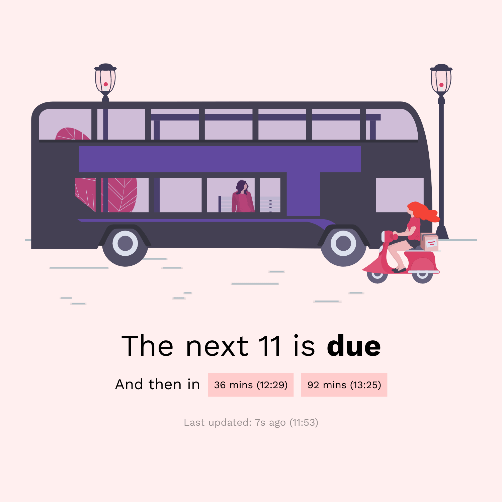
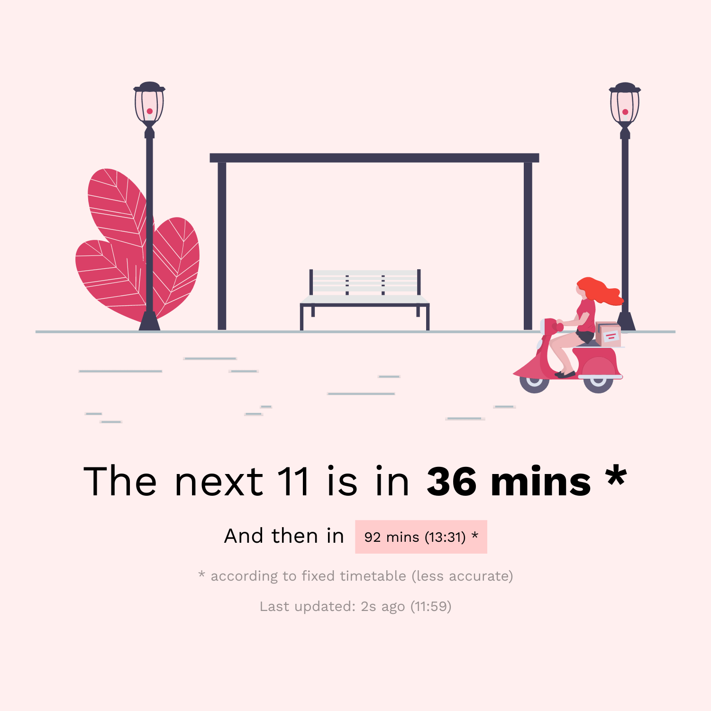

# 🚌 Beautiful bus display [(view live)](https://adamjones.me/west-midlands-bus-display/)

This displays upcoming buses in the West Midlands, using the most accuate API I could find. Initially written to be used in a smart TV browser, to become a 'bus departures' channel.

Many of the illustrations are taken from the amazing [unDraw](https://undraw.co/).

## 🚏 Show my own bus stop

Add `?stopId=YOUR_STOP_ID&serviceNumber=YOUR_SERVICE_NUMBER` to the URL

For example [`?stopId=43000008102&serviceNumber=12X`](https://adamjones.me/west-midlands-bus-display/?stopId=43000008102&serviceNumber=12X)

## 🙌 Contributing

Contributions are welcomed as issues or pull requests on GitHub

Apologies for the rather messy code - this was a short day project where the main aim was to make something pretty (and where all features were supported by a smart TV browser).

## 🖼 More screenshots

<table>
  <tbody>
    <tr>
      <td></td>
      <td></td>
    </tr>
    <tr>
      <td></td>
      <td></td>
    </tr>
    <tr>
      <td></td>
      <td></td>
    </tr>
  </tbody>
</table>
